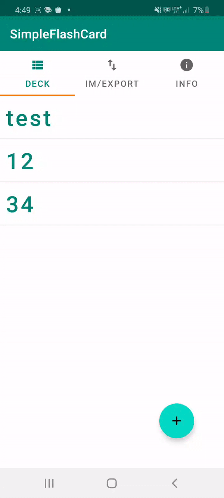
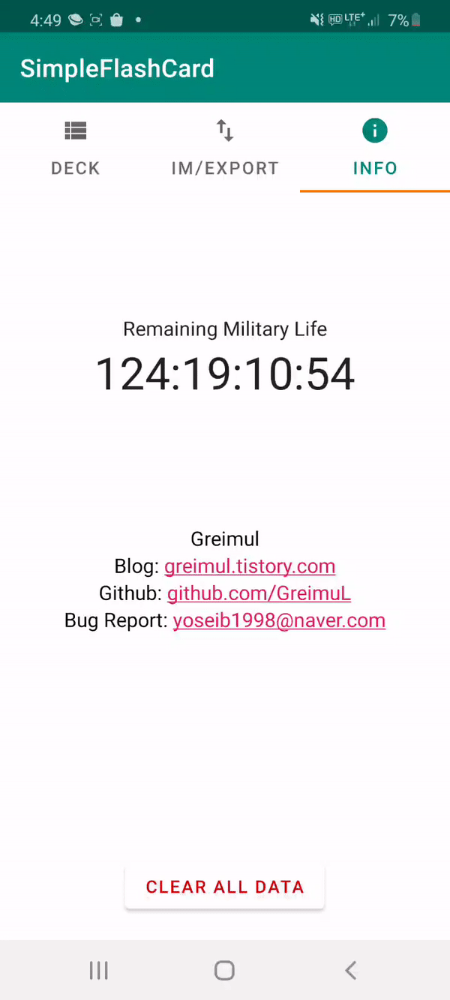

# SimpleFlashCard
MVVM, Room-database, Coroutine, SAF, LiveData
    
More Info: https://greimul.tistory.com/41    
   
# Screenshots  
## Create deck and card, Deck play   
 
        
   
## Import   
        
   
## Export, Share, Data reset
         
   
## Info
    

